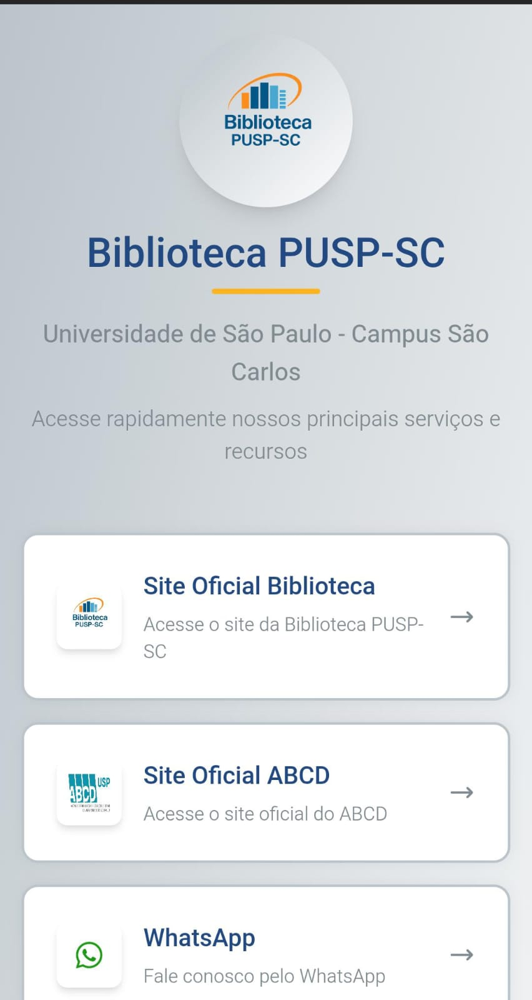

# BiblioLinks | Agregador de Links da PUSP-SC

Uma aplicação web simples e customizável que centraliza os links importantes da Biblioteca da Prefeitura do Campus da USP de São Carlos (PUSP-SC), funcionando como uma alternativa gratuita e de código aberto a serviços como o Linktree.

 

  

 

## 🚀 Sobre o Projeto

A Biblioteca da PUSP-SC precisava de uma página para centralizar seus links mais importantes (catálogo online, redes sociais, formulários, etc.). A solução utilizada era o Linktree, um serviço pago que, além dos custos, oferecia pouca flexibilidade de customização para as necessidades da biblioteca.

Para resolver isso, desenvolvi o BiblioLinks: uma aplicação de código aberto que cumpre a mesma função, mas com duas grandes vantagens:

**Custo Zero:** Elimina a necessidade de assinaturas.

**Totalmente Customizável:** Permite adaptar o visual e as funcionalidades para se alinhar perfeitamente com a identidade visual e as demandas da USP.

## ✨ Funcionalidades

* **Listagem Centralizada:** Exibe todos os links importantes em uma única página.
* **Design Responsivo:** Funciona perfeitamente em desktops e celulares.
* **Painel de Administração (Opcional):** [Se você criou um] Interface para adicionar, editar, reordenar e remover links sem precisar mexer no código.
* **Fácil Customização:** Altere cores, fontes e o logo diretamente nos arquivos de configuração ou CSS.

## 🛠️ Tecnologias Utilizadas

**Frontend:** ` [React, Vite, HTML, CSS, JavaScript e taildwind] `
